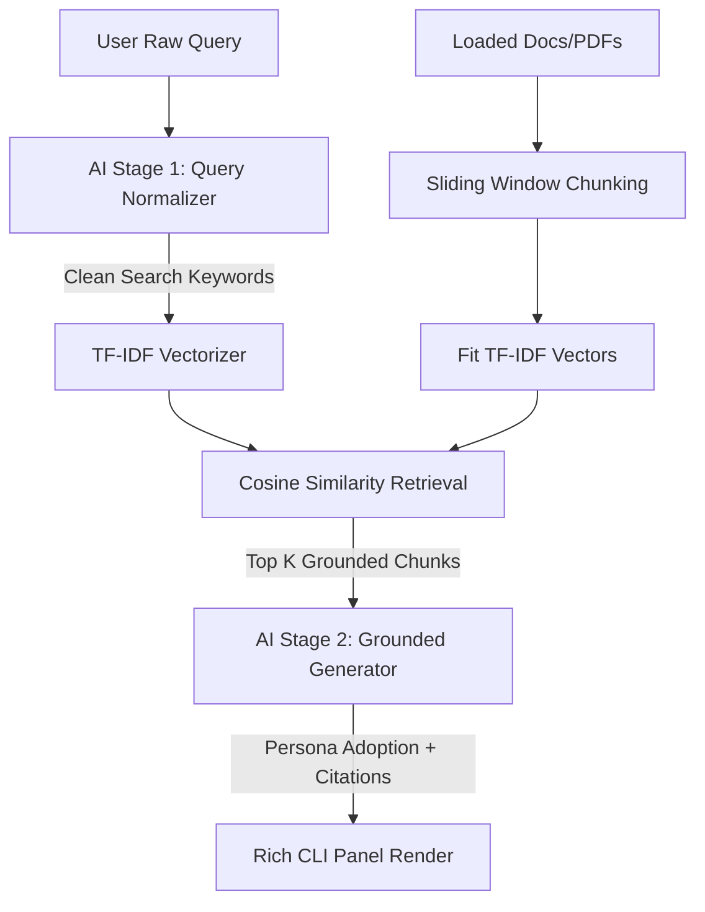

# 5 Mini-RAG Applications

A complete, modular, and interactive Python-based RAG (Retrieval-Augmented Generation) system. This workspace includes a single, reusable core engine (`rag_engine.py`) and 5 operational, interactive use case bots.

## Features
- **Re-usable Core Engine**: Handles text preprocessing, PDF extraction, sliding-window chunking, and vector retrieval.
- **Query Normalization (AI Stage 1)**: Utilizes Claude to fix typos, expand intent, and optimize raw search terms for TF-IDF keyword match.
- **TF-IDF Semantic Match**: Leverages `scikit-learn` to calculate cosine similarities between normalized queries and text chunks.
- **Grounded Generation (AI Stage 2)**: Constrains Claude to answer *only* from matching document chunks and requires inline bracket citations.
- **Premium CLI Experience**: Built using `rich` with beautiful banners, status spinners, custom query badges, and clean markdown display panels.

---

## Workspace Structure
```
├── requirements.txt         # Project dependencies
├── rag_engine.py            # Base reusable RAG Engine class
├── interview_prep_bot.py    # Use Case 1: Resume coaching chatbot
├── campus_faq_bot.py        # Use Case 2: Student policies and FAQ assistant
├── study_buddy_bot.py        # Use Case 3: OS scheduling revision study partner
├── ecommerce_support_bot.py  # Use Case 4: Product info & store policies support bot
├── code_docs_bot.py         # Use Case 5: Technical API docstring search assistant
└── README.md                # Documentation
```

---

## Prerequisites & Installation

1. **Python 3.8+** must be installed.
2. Clone or open the project folder.
3. Install the dependencies listed in `requirements.txt`:
   ```bash
   pip install -r requirements.txt
   ```
4. Set up your Anthropic API Key:
   - On Windows (PowerShell):
     ```powershell
     $env:ANTHROPIC_API_KEY="your-api-key-here"
     ```
   - On Windows (CMD):
     ```cmd
     set ANTHROPIC_API_KEY=your-api-key-here
     ```
   - On Linux/macOS:
     ```bash
     export ANTHROPIC_API_KEY="your-api-key-here"
     ```

---

## Usage Instructions

Run any of the 5 use cases by executing their corresponding python script:

### 1. Interview Prep Bot
🎯 Helps candidates practice interview questions based on their resume (supports checking local `resume.pdf` or falls back to default profile).
```bash
python interview_prep_bot.py
```

### 2. Campus FAQ Assistant
🎓 Answers student queries about curfew timings, library rules, internal exam dates, and payment late fees.
```bash
python campus_faq_bot.py
```

### 3. Exam Study Buddy
📚 Explains operating system scheduling algorithms (FCFS, SJF, RR) and context switching overhead in simple terms.
```bash
python study_buddy_bot.py
```

### 4. Mini E-Commerce Support Bot
🛍️ Answers product questions for the Everyday Backpack (BP-102), store return periods, shipping costs, and warranties.
```bash
python ecommerce_support_bot.py
```

### 5. Code Documentation Assistant
⚡ Helps lookup docstrings and signatures for `chunk_text()`, `retrieve()`, and `ask()`.
```bash
python code_docs_bot.py
```

---

## Architectural Workflow

